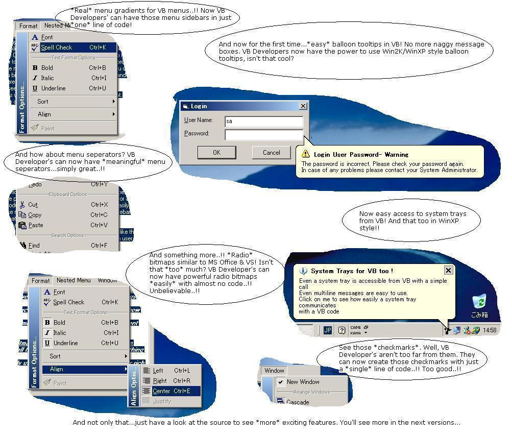

## SuperCode \(Version 2\.2\.0\.9\)

### Description

Well, now VB developers do not have to worry any more about API's for having custom menus, system information, system tray access, multiline and balloon tooltips. All are under *one* roof. Just a reference to a DLL to your VB project and that's it. With just one line of code, you can create *wonders* to VB code and that too very very professional.

Making Developer's Life Easier.. !!
 
### More Info
 
Contains some feature requests from users in the new version.

             |
---                |---
**Submitted On**   |2002-06-18 15:30:46
**By**             |[Shantibhushan Naik](https://github.com/Planet-Source-Code/PSCIndex/blob/master/ByAuthor/shantibhushan-naik.md)
**Level**          |Advanced
**User Rating**    |5.0 (675 globes from 136 users)
**Compatibility**  |VB 6\.0
**Category**       |[OLE/ COM/ DCOM/ Active\-X](https://github.com/Planet-Source-Code/PSCIndex/blob/master/ByCategory/ole-com-dcom-active-x__1-29.md)
**World**          |[Visual Basic](https://github.com/Planet-Source-Code/PSCIndex/blob/master/ByWorld/visual-basic.md)
**Archive File**   |[SuperCode\_963926192002\.zip](https://github.com/Planet-Source-Code/shantibhushan-naik-supercode-version-2-2-0-9__1-35748/archive/master.zip)

### API Declarations

REM /* You find most of them in the source code. */

